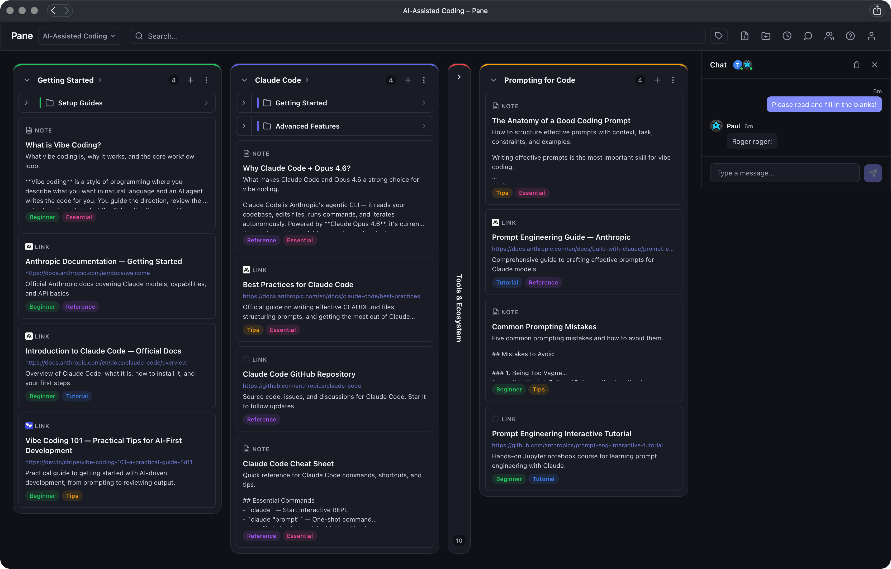

# Pane

A local-only Kanban dashboard for organizing links, notes, and documents into draggable columns. Built with SvelteKit 2, Svelte 5, and SQLite.

All data stays on your machine — no accounts, no cloud, no tracking.



## Features

- **Kanban board** — Organize content into columns with drag-and-drop reordering
- **Three item types** — Links (with URL display), markdown notes, and file uploads
- **Spaces** — Isolated workspaces, each with its own database and file storage
- **Hierarchical categories** — Nest subcategories for deeper organization
- **Tags & filtering** — Colored tags with multi-tag filtering, combined with search
- **Search** — Full-text search across titles, descriptions, and content
- **Drag and drop** — Reorder items and columns, or drop URLs and files directly onto a column
- **Markdown** — Notes render full markdown with syntax highlighting and sanitized HTML
- **Theming** — Light, dark, and system-following themes with 8 accent colour palettes
- **Keyboard shortcuts** — `/` or `Cmd+K` to search, `Cmd+N` for new item, `Cmd+Shift+N` for new category
- **Sample data** — One-click loading of curated content to explore the app instantly

## Quick start

```bash
git clone https://github.com/TomGem/Pane.git
cd Pane
pnpm install
pnpm dev
```

Open [http://localhost:5173](http://localhost:5173). On first launch you'll see an empty board — click **Load Sample Data** to get started, or create your own categories.

### Docker

No Node.js required — just Docker:

```bash
docker compose up -d
```

Open [http://localhost:3000](http://localhost:3000). Data persists in `./data/` and `./storage/`.

## Documentation

| Guide | Description |
|-------|-------------|
| [Getting Started](docs/getting-started.md) | Installation, requirements, and first run |
| [User Guide](docs/user-guide.md) | How to use Pane — spaces, items, tags, shortcuts |
| [Architecture](docs/architecture.md) | Technical overview for developers |
| [Deployment](docs/deployment.md) | Production builds and self-hosting |

## Tech stack

- **[SvelteKit 2](https://svelte.dev/docs/kit)** — Full-stack framework with SSR and API routes
- **[Svelte 5](https://svelte.dev/docs/svelte)** — Runes-based reactivity (`$state`, `$derived`, `$effect`)
- **[better-sqlite3](https://github.com/WiseLibs/better-sqlite3)** — Synchronous SQLite driver with WAL mode
- **[svelte-dnd-action](https://github.com/isaacHagworthy/svelte-dnd-action)** — Drag-and-drop for columns and items
- **[marked](https://github.com/markedjs/marked)** + **[DOMPurify](https://github.com/cure53/DOMPurify)** — Markdown rendering with XSS sanitization

## License

This project was created as part of a coding bootcamp and is intended for educational use.
