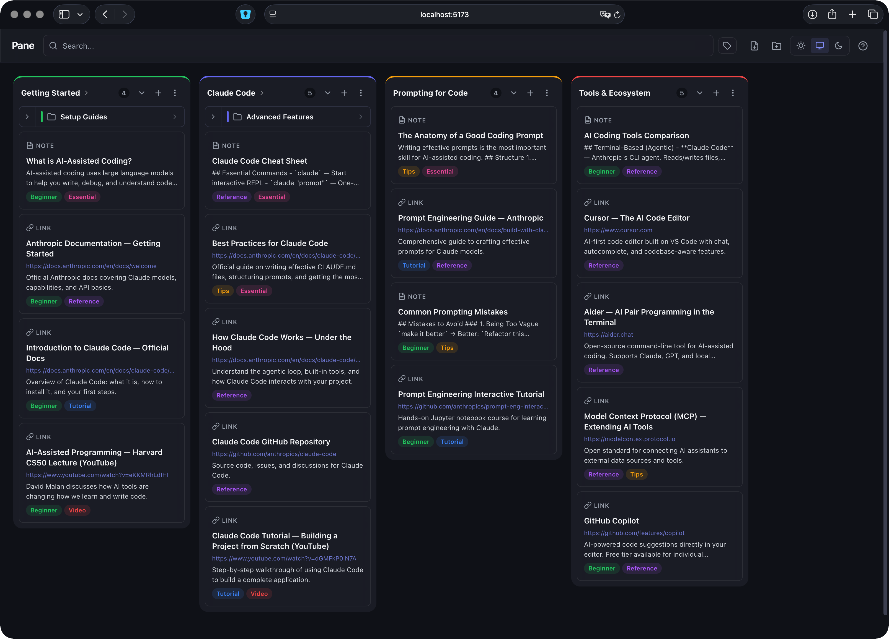

# Pane

A local-only Kanban dashboard for organizing links, notes, and documents into draggable columns. Built with SvelteKit 2, Svelte 5, and SQLite.

All data stays on your machine — no accounts, no cloud, no tracking.



## Features

- **Kanban board** — Organize content into columns (categories) with drag-and-drop reordering
- **Three item types** — Links (with auto-fetched metadata), notes, and file/document uploads
- **Hierarchical categories** — Nest subcategories for deeper organization
- **Tags** — Create colored tags and filter items by one or multiple tags
- **Search** — Full-text search across titles, descriptions, and content
- **Drag and drop** — Reorder items and columns, or drop URLs and files directly onto a column
- **Theming** — Light, dark, and system-following themes with a glass-blur UI
- **Keyboard shortcuts** — `/` or `Cmd+K` to search, `Cmd+N` for new item, `Cmd+Shift+N` for new category
- **Sample data** — One-click loading of curated AI coding resources to explore the app instantly

## Getting Started

```bash
pnpm install
pnpm dev
```

Then open [http://localhost:5173](http://localhost:5173).

## Requirements

- **Node.js** 20 or later
- **pnpm** (recommended) — npm or yarn also work but the lockfile is pnpm-based
- A C/C++ toolchain (see below)

### Platform-specific build tools

One of the dependencies (`better-sqlite3`) compiles a native SQLite binding during `pnpm install`. This requires a C/C++ compiler to be present on your system:

**macOS**

```bash
xcode-select --install
```

**Linux (Debian / Ubuntu)**

```bash
sudo apt-get install build-essential python3
```

**Linux (Fedora)**

```bash
sudo dnf groupinstall "Development Tools"
```

**Windows**

Open PowerShell **as Administrator** and run:

```powershell
npm install -g windows-build-tools
```

Or install [Visual Studio Build Tools](https://visualstudio.microsoft.com/visual-cpp-build-tools/) with the "Desktop development with C++" workload.

## Getting started

### 1. Clone the repository

```bash
git clone https://github.com/TomGem/Pane.git
cd Pane
```

### 2. Install dependencies

```bash
pnpm install
```

### 3. Start the development server

```bash
pnpm dev
```

Open [http://localhost:5173](http://localhost:5173) in your browser. On first launch you'll see an empty board — click **Load Sample Data** to populate it with curated AI coding resources, or create your own categories.

## Scripts

| Command             | Description                                  |
| ------------------- | -------------------------------------------- |
| `pnpm dev`          | Start dev server at http://localhost:5173     |
| `pnpm build`        | Production build (uses `adapter-node`)       |
| `pnpm preview`      | Preview the production build locally         |
| `pnpm check`        | Run `svelte-check` for type errors           |
| `pnpm check:watch`  | Continuous type-checking in watch mode       |

## Production build

```bash
pnpm build
node build
```

The production server runs on port 3000 by default. Configure with the `PORT` environment variable:

```bash
PORT=8080 node build
```

## Project structure

```
src/
  lib/
    components/     Svelte 5 components (Board, Column, Card, Modal, etc.)
    server/         Server-only code (db.ts, schema.ts, storage.ts)
    stores/         Reactive stores using Svelte 5 runes (board, theme)
    types/          TypeScript interfaces
    utils/          Shared utilities (slugify)
  routes/
    +layout.svelte  App shell with toolbar and theme
    +page.svelte    Main board page
    api/            REST endpoints (categories, items, tags, seed, files)
data/               SQLite database (gitignored, auto-created)
storage/            Uploaded documents (gitignored)
static/             Static assets (favicon)
```

## Tech stack

- **[SvelteKit 2](https://svelte.dev/docs/kit)** — Full-stack framework with SSR and API routes
- **[Svelte 5](https://svelte.dev/docs/svelte)** — Runes-based reactivity (`$state`, `$derived`, `$effect`)
- **[better-sqlite3](https://github.com/WiseLibs/better-sqlite3)** — Synchronous SQLite driver with WAL mode
- **[svelte-dnd-action](https://github.com/isaacHagworthy/svelte-dnd-action)** — Drag-and-drop for columns and items
- **[marked](https://github.com/markedjs/marked)** + **[DOMPurify](https://github.com/cure53/DOMPurify)** — Markdown rendering with XSS sanitization
- **[slugify](https://github.com/simov/slugify)** — URL-safe slug generation for categories

## License

This project was created as part of a coding bootcamp and is intended for educational use.